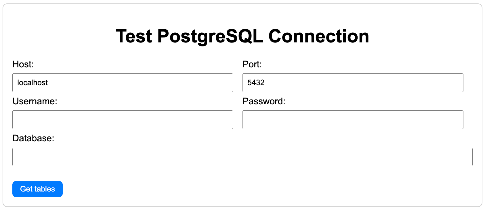
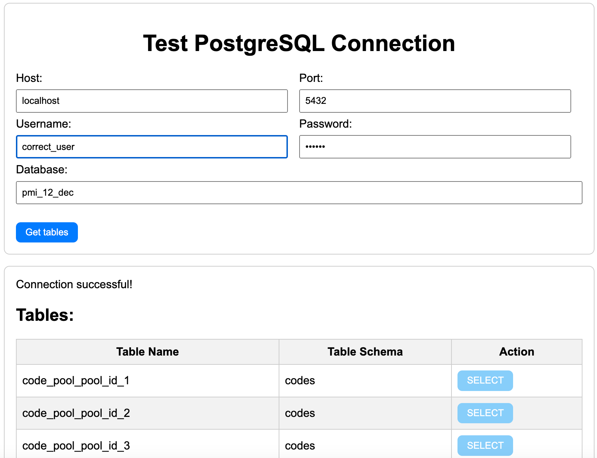
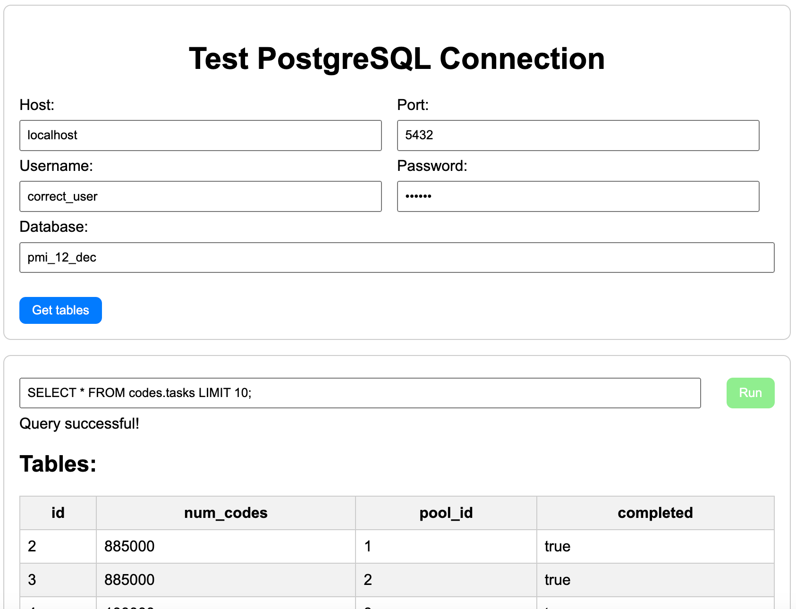
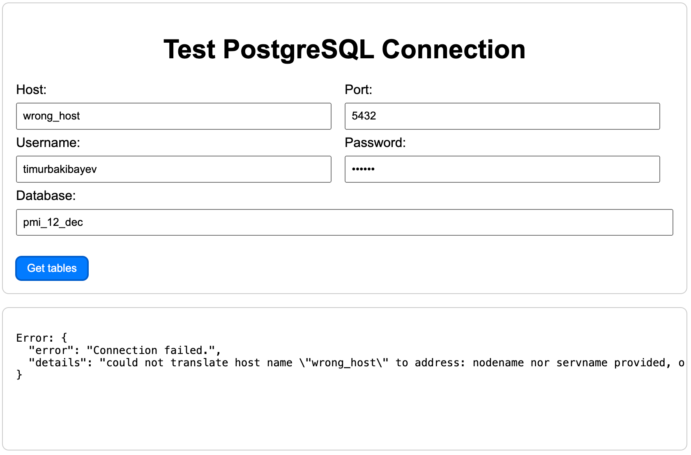
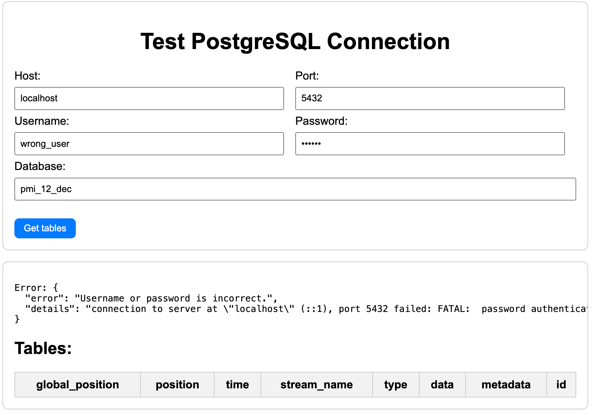

# postgresql_web

This is a FastAPI project that allows testing PostgreSQL database connections.

## Getting Started

## Running the FastAPI application using Docker

There is a Dockerfile that can be used to build a Docker image. The image can be used to run the FastAPI application.

To build the Docker image, execute the following command:

If you need to access "localhost" from this image, use: `host.docker.internal` instead of `localhost`.

```bash
docker build -t postgresql_web .
```

To run the Docker container, execute the following command:

```bash
docker run -p 80:00 postgresql_web
```

The FastAPI application will be available at `http://localhost`.

## Running the FastAPI application locally

To run the FastAPI application, execute the following command:

```bash
pip install -r requirements.txt
python main.py
```

The FastAPI application will be available at `http://localhost:8000`.

## Using the FastAPI application

Open the application with any browser, you should get this page:



Here, enter the following details:

- **Host**: The host of the PostgreSQL database.
- **Port**: The port of the PostgreSQL database.
- **Database**: The name of the PostgreSQL database.
- **User**: The user of the PostgreSQL database.
- **Password**: The password of the PostgreSQL database.

Click on the `Get tables` button to test the connection to the PostgreSQL database.

In case if the connection is successful, you should get the following page:



For any table, you can now click on the "Select" button to get the data from the table.

In case if table is found and data is fetched successfully, you should get the following page:



You can also enter a custom query in the text box and click on the "Run" button to execute the query.

## If something goes wrong

In case if the connection to the PostgreSQL database fails, you should get the following page:



In case if the connection is successful but the username or password is incorrect, you should get the following page:



## Using the service with API:

The service can also be used with API. The API endpoint is `/perform_request/`.

The docs for the API can be found at `/docs`.

